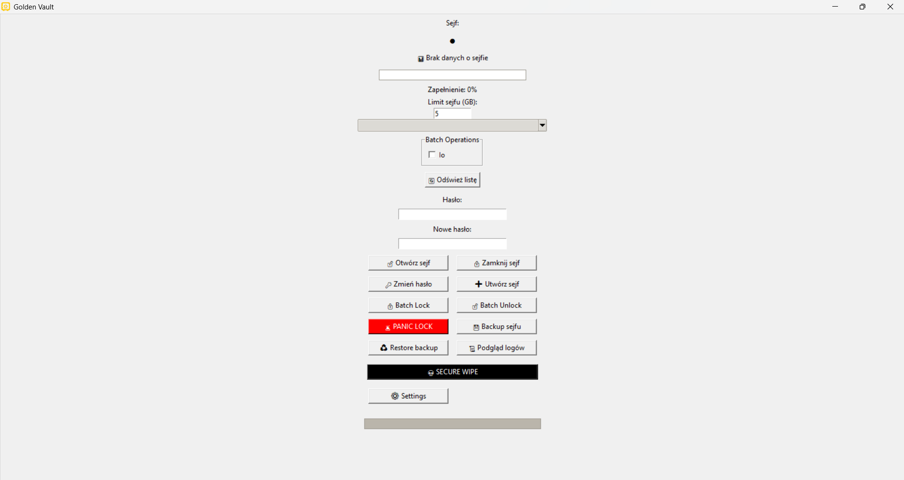
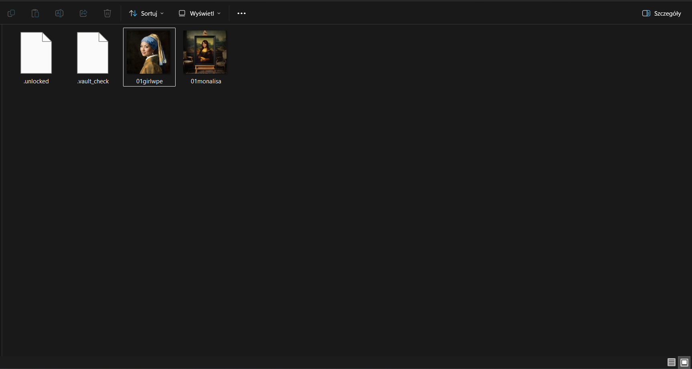
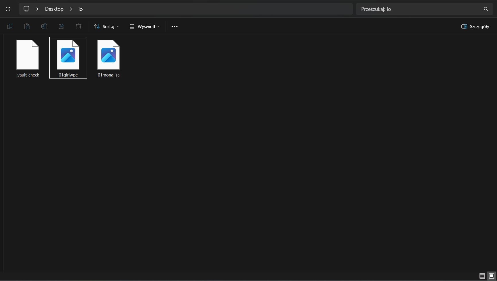
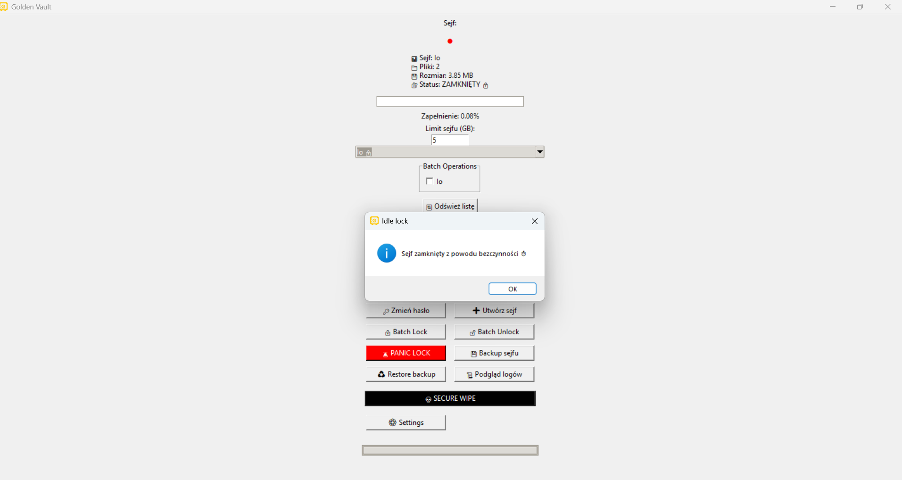

# Golden Vault

Golden Vault is a desktop application for securing folders using password-based encryption.

The application allows users to lock and unlock folders on the Desktop, protecting files with strong encryption.

---

## Features

-  Password protected vault folders
-  Automatic vault detection on Desktop
-  Lock / Unlock vaults
-  Change vault password
-  Vault backup system
-  Restore vault from backup
-  Secure wipe (irreversible deletion)
-  Panic lock (lock all vaults instantly)
-  Vault size monitoring
-  Idle auto-lock protection
-  Operation logging

---

## Technology

- Python
- Tkinter GUI
- Cryptography (Fernet encryption)
- JSON configuration
- ZIP backup system

---

## Application Preview

### Main Interface


### Unlock Vault


### Unlocked Vault


### Lock Vault


### Locked Vault


### Idle Lock


---

## Installation

Clone the repository:

```bash
git clone https://github.com/czuameni/golden-vault.git
